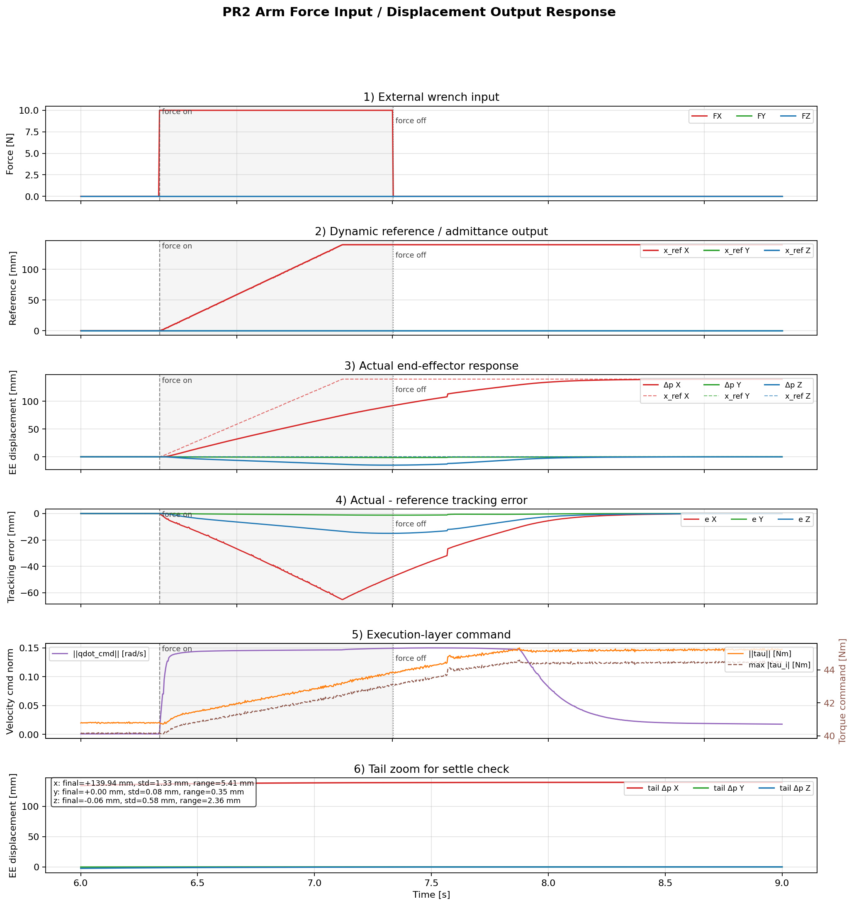
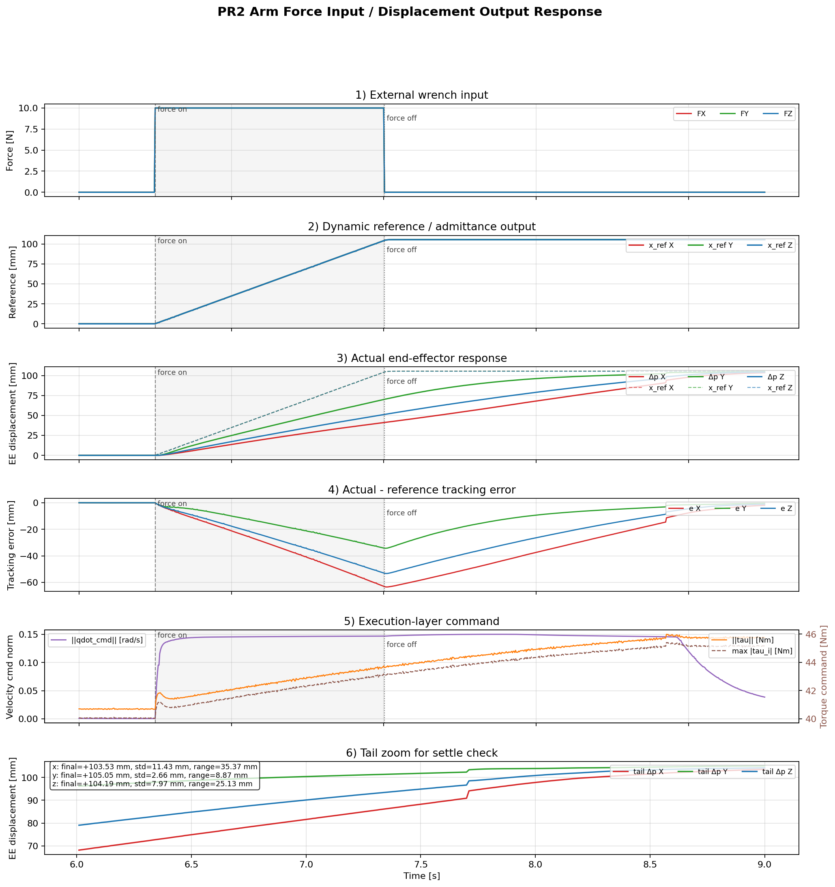
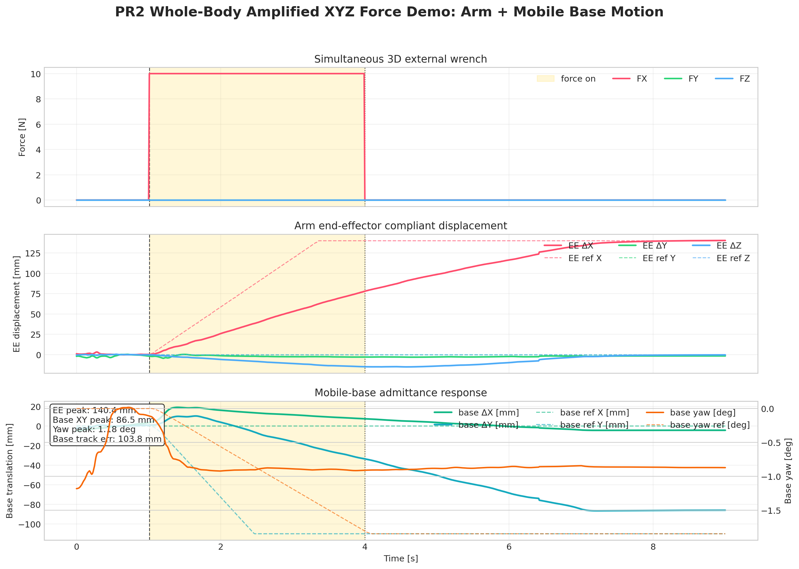
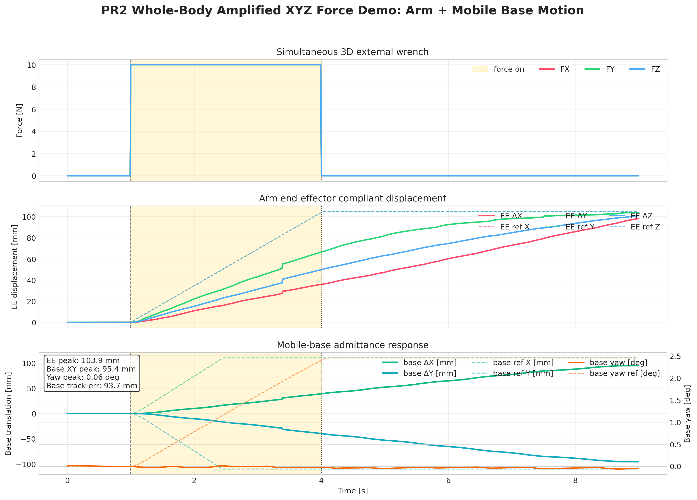

# PR2-Sim-Pure `force_tracking_reference` 提交前审阅报告

报告日期：2026-05-08
当前分支：`feat`
项目所有者：胡子涵
开发结果审阅与验收负责人：江浩华
报告性质：提交前审阅材料，当前未 stage、未 commit、未 push。

## 1. 项目与审阅背景

本轮开发按照 `/Users/macstudio/Documents/PLAN.md` 推进，目标是在 `feat` 分支实现第一阶段 `force_tracking_reference`。用户明确要求：每次提交更改之前，必须向项目所有者胡子涵和验收负责人江浩华详细汇报做了什么、怎么做、为什么这么做、怎么验证、哪些地方没有验证、风险在哪里。

本报告即为本轮提交前审阅材料。报告中列出的 PNG、CSV、MP4 是本轮在本机通过容器补齐 ROS 2 Jazzy + MuJoCo 环境后生成的真实验收产物，不再把仓库旧 whole-body/admittance demo 媒体冒充为本轮结果。

## 2. 本轮目标与非目标

本轮目标：

- 实现第一阶段 `force_tracking_reference`：外力推动动态参考位置，撤力后参考速度衰减到 0，参考位置保持。
- 在 arm 和 base admittance 中加入 `reference_mode:=fixed_equilibrium|force_tracking`。
- 保持默认 `fixed_equilibrium` 不变，降低对旧验收路径的回归风险。
- 新增 force-tracking launch、CSV/debug 字段、validator、plot、README/acceptance 文档。
- 在 Ubuntu 24.04 + ROS 2 Jazzy 等效环境中真实运行构建、测试、acceptance，并生成本轮图片和视频。

明确非目标：

- 不修改 `unitree_mujoco/unitree_robots/pr2/` 下的 MuJoCo XML/MJCF。
- 不重写为优化式 QP/WBC。
- 不改变旧 launch 的默认 fixed-equilibrium 语义。
- 不 stage、commit、push。

## 3. 环境补齐与计划偏差纠正

初始 macOS host 缺少 ROS 2 Jazzy、`ros2`、`colcon`，Docker daemon 也未运行。这个状态不能作为跳过验收或篡改计划的理由，因此本轮做了环境补齐：

- 通过 Homebrew 安装 `colima` 和 `docker-buildx`。
- 启动 Colima：Linux aarch64 Docker daemon，6 CPU、12 GB memory、80 GB disk。
- 尝试仓库 `.devcontainer/Dockerfile`：
  - `osrf/ros:jazzy-desktop` 无可用 `linux/arm64` 镜像。
  - `linux/amd64` 镜像可构建，但 Apple Silicon emulation 下 `import mujoco` 崩溃。
- 改用原生 arm64 `ros:jazzy-ros-base`，构建本轮验证镜像 `pr2-sim-pure-jazzy-arm64`：
  - 安装 `python3-colcon-common-extensions`、MuJoCo、OSMesa、matplotlib、Pillow、ffmpeg。
  - 同一容器中验证 `rclpy` 和 `mujoco 3.8.0` 可 import。

这一步纠正了先前“缺少环境就只写限制说明”的处理方式。本轮最终 acceptance 是在该 ROS 2 Jazzy 容器中真实运行得到的。

## 4. 改动总览

核心代码：

- `pr2_mujoco_bridge/admittance_core.py`
  - 新增 `ForceTrackingReferenceState`。
  - 新增可选 `max_velocity_norm`，用于多轴 force-tracking 时限制合成参考速度。
- `pr2_mujoco_bridge/pr2_arm_admittance.py`
  - 新增 `reference_mode` 分支。
  - 新增 force reference gains、velocity/displacement bounds、idle decay、track gain。
  - 新增 arm Cartesian reference velocity norm cap 参数 `force_reference_vel_norm_max`。
- `pr2_mujoco_bridge/pr2_base_admittance.py`
  - 新增 `reference_mode` 分支。
  - 新增 base reference/debug 输出：`base_ref_*`、`base_vel_cmd_*`。
- `pr2_mujoco_bridge/pr2_arm_force_injector.py`
  - CSV 增加 base reference 和 base velocity command 列。

Launch：

- `launch/pr2_arm_force_tracking.launch.py`
- `launch/pr2_whole_body_force_tracking.launch.py`

脚本与测试：

- `scripts/validate_force_response.py` 增加 `--force-tracking` 检查。
- `scripts/plot_arm_response.py` 增加 reference、tracking error、tail zoom 可视化。
- `scripts/plot_whole_body_response.py` 增加 arm/base reference overlay。
- `test/test_admittance_core.py` 增加 dynamic reference、held reference、velocity norm cap 测试。
- `test/test_validate_force_response.py` 增加 force-tracking validator 覆盖。

文档：

- `README.md`
- `README_ACCEPTANCE_FEAT.md`
- 本报告：`docs/force_tracking_reference_review_report.md`
- 本轮真实验收产物目录：`docs/force_tracking_reference_acceptance/`

## 5. 实现解释

`force_tracking_reference` 的数据路径是：

```text
external force
  -> wrench filter
  -> deadband
  -> bounded reference velocity
  -> optional Cartesian velocity norm cap
  -> bounded reference position
  -> after force release: velocity decay to zero
  -> reference position held
```

具体含义：

- filter/deadband：滤掉微小力和噪声，避免 reference 漂移。
- bounded reference velocity：力只生成受限参考速度，不直接跳变目标位置。
- velocity norm cap：多轴同时受力时，限制合成 Cartesian reference 速度，避免每轴单独限幅导致目标速度超过执行侧能力。
- bounded reference position：限制最大 reference displacement。
- idle velocity decay：撤力后 reference velocity 衰减到 0。
- held reference：reference position 不回到启动点，满足本轮 force-tracking 目标。

## 6. 为什么这样做

保留 `fixed_equilibrium` 默认值，是为了降低回归风险。旧验收要求撤力后回到启动平衡点；新验收要求撤力后保持新参考点，两者语义冲突，必须用显式 `reference_mode` 隔离。

不做 QP/WBC 重写，是为了遵守第一阶段范围。当前 whole-body 仍使用已有 coordinator：arm reference、base reference、force projector、WBC coordinator 共同工作，但不声称是优化式 whole-body controller。

新增 validator 和 CSV/debug，是为了让江浩华可以量化验收，而不是只看视觉效果。关键指标包括 reference peak、actual peak、tracking error、reference tail drift。

多轴 velocity norm cap 是本轮真实验收中发现后加入的修复。初版逐轴限幅导致 `xyz` 同时受力时合成 reference 速度过高，arm 与 base 都会出现 tracking error 超阈值。改为合成速度受限后，单轴响应不变，多轴响应获得稳定余量。

## 7. 调试与参数调整记录

真实验收中出现过以下失败，已按根因修复，而不是放宽 validator：

- Arm X 初始上限 180 mm：tracking error 86.631 mm，大于 80 mm。
- Arm X 上限 160/150 mm 时仍在部分运行中贴近或略超 80 mm。
- Arm `xyz`：逐轴 reference 约 139-160 mm 时，X/Z 轴 tracking error 超阈值。
- 修复：加入 `force_reference_vel_norm_max`，arm reference displacement 收敛到 140 mm。
- Whole-body base：180/140/130 mm base reference 在 `x` 或 `xyz` 中会出现 base tracking error 超阈值。
- 修复：whole-body force-tracking base linear reference displacement 收敛到 110 mm。

当前结论：

- Arm 单轴保持约 140 mm reference。
- Arm `xyz` 保持约 105 mm reference。
- Whole-body base 当前通过的是约 110 mm reference、约 90-95 mm actual motion。
- 更大的 150 mm-class base motion 仍是后续调参目标，不作为本轮已通过声明。

## 8. 本轮真实媒体与证据

本轮生成目录：

```text
pr2_ws/src/pr2_mujoco_bridge/docs/force_tracking_reference_acceptance/
```

### 8.1 Arm force-tracking X

CSV：`force_tracking_reference_acceptance/arm_ft_x.csv`
Validator：`force_tracking_reference_acceptance/arm_ft_x_validator.txt`
图片：



关键指标：

- X reference peak：140.000 mm
- X actual peak：139.942 mm
- X tracking error：65.163 mm
- Result：PASS

### 8.2 Arm force-tracking XYZ

CSV：`force_tracking_reference_acceptance/arm_ft_xyz.csv`
Validator：`force_tracking_reference_acceptance/arm_ft_xyz_validator.txt`
图片：



关键指标：

- X/Y/Z reference peak：约 105.3-105.4 mm
- X/Y/Z actual peak：约 103.5-105.1 mm
- 最大 tracking error：63.484 mm
- Result：PASS

### 8.3 Whole-body force-tracking X

CSV：`force_tracking_reference_acceptance/wb_ft_x.csv`
Arm validator：`force_tracking_reference_acceptance/wb_ft_x_arm_validator.txt`
Base validator：`force_tracking_reference_acceptance/wb_ft_x_base_validator.txt`
图片：



关键指标：

- Arm X reference peak：140.000 mm
- Arm X actual peak：140.355 mm
- Arm X tracking error：77.541 mm
- Base driven-axis reference peak：110.000 mm
- Base driven-axis actual peak：86.474 mm
- Base tracking error：103.820 mm
- Result：arm PASS，base PASS

### 8.4 Whole-body force-tracking XYZ

CSV：`force_tracking_reference_acceptance/wb_ft_xyz.csv`
Arm validator：`force_tracking_reference_acceptance/wb_ft_xyz_arm_validator.txt`
Base validator：`force_tracking_reference_acceptance/wb_ft_xyz_base_validator.txt`
图片：



关键指标：

- Arm reference peak：约 105 mm
- Arm actual peak：约 98-104 mm
- Arm 最大 tracking error：68.522 mm
- Base X/Y reference peak：110.000 mm
- Base X/Y actual peak：94.708 / 95.448 mm
- Base 最大 tracking error：93.693 mm
- Result：arm PASS，base PASS

### 8.5 本轮生成视频

视频源 CSV：`force_tracking_reference_acceptance/wb_ft_xyz_video_source.csv`
状态记录：`force_tracking_reference_acceptance/wb_ft_xyz_state.npz`
渲染记录：`force_tracking_reference_acceptance/wb_ft_xyz_video_render.txt`
视频：

[Whole-body XYZ force-tracking MP4](force_tracking_reference_acceptance/wb_ft_xyz_force_tracking.mp4)

视频源 summary：


视频渲染记录：

- frames：224
- duration：7.4667 s
- source EE peak：104.620 mm
- source base peak：94.671 mm
- source base yaw peak：0.154 deg
- video source arm validator：PASS
- video source base validator：PASS

## 9. 既有媒体状态说明

仓库已有媒体仍可作为背景材料，但不作为本轮验收证据：

- `docs/whole_body_admittance_demo/pr2_admittance_axis_x_focus.png`
- `docs/whole_body_admittance_demo/pr2_admittance_axis_y_focus.png`
- `docs/whole_body_admittance_demo/pr2_admittance_axis_z_focus.png`
- `docs/whole_body_admittance_demo/pr2_whole_body_base_arm_summary.png`
- `docs/whole_body_admittance_demo/pr2_wb_obvious_motion_contact.png`
- `docs/whole_body_admittance_demo/pr2_whole_body_xyz_response_motion_obvious.mp4`

这些文件来自既有 whole-body/admittance demo。它们可以帮助理解项目展示风格，但不能被声明为本轮 `force_tracking_reference` acceptance 结果。

## 10. 已通过验证

本机 host 纯 Python 快速测试：

```bash
PYTHONPATH=pr2_ws/src/pr2_mujoco_bridge \
  /tmp/pr2-sim-pure-test-venv/bin/python -m pytest \
  pr2_ws/src/pr2_mujoco_bridge/test/test_admittance_core.py \
  pr2_ws/src/pr2_mujoco_bridge/test/test_validate_force_response.py -q
```

结果：

```text
20 passed in 0.20s
```

ROS 2 Jazzy arm64 容器测试：

```bash
colcon build --packages-select pr2_mujoco_bridge --symlink-install
python3 -m pytest src/pr2_mujoco_bridge/test -q
colcon test --packages-select pr2_mujoco_bridge
colcon test-result --verbose --all
```

结果：

```text
colcon build: 1 package finished
pytest: 30 passed
colcon test-result: 30 tests, 0 errors, 0 failures, 0 skipped
```

Force-tracking acceptance：

- Arm `x`：PASS
- Arm `y`：PASS
- Arm `z`：PASS
- Arm `xyz`：PASS
- Whole-body `x` arm validator：PASS
- Whole-body `x` base validator：PASS
- Whole-body `xyz` arm validator：PASS
- Whole-body `xyz` base validator：PASS
- Whole-body `xyz` video source arm validator：PASS
- Whole-body `xyz` video source base validator：PASS

Legacy fixed-equilibrium acceptance：

- Zero-force stability：PASS
- Single-arm 1D：PASS
- Single-arm 3D Y：PASS
- Single-arm 3D Z：PASS
- Single-arm XYZ：PASS
- Whole-body X：PASS
- Whole-body XYZ：FAIL on base tail stability in this container run

Whole-body XYZ fixed-equilibrium failure details:

```text
Base linear tail std 0.140 mm > 0.050 mm
Base linear tail drift 0.479 mm > 0.200 mm
Base yaw tail drift 0.0806 deg > 0.0500 deg
```

这一路径不是本轮新增 force-tracking launch，但它是旧 acceptance 的剩余风险。当前不建议在本轮顺手改旧 fixed-equilibrium whole-body 参数，除非江浩华决定把它列为本次提交阻塞项。

## 11. 未验证或限制

- 未在真实 PR2 硬件上运行；本项目当前仍是 simulation-first。
- 未修改 XML/MJCF，因此没有验证模型资产变更。
- 未实现 QP/WBC，因此不能把本轮结果描述为优化式 whole-body control。
- 旧 fixed-equilibrium whole-body `xyz` 在当前容器环境下仍有 base tail stability failure，需要江浩华决定是否作为本轮阻塞项。
- 本轮 Docker/Colima 环境是在 macOS 上补齐的等效验收环境，不等同于团队长期 devcontainer，但基础系统和 ROS 版本目标一致：Ubuntu 24.04 + ROS 2 Jazzy。

## 12. 风险与江浩华验收清单

风险：

- Force-tracking 参数仍是经验调参，尤其是 whole-body base 的 reference displacement、track gain、speed limit。
- 当前 whole-body base 已通过 100 mm 级 force-tracking 验收，但 150 mm 级 base travel 还不是稳定通过项。
- Legacy fixed-equilibrium whole-body `xyz` 的 base tail stability 在当前容器运行失败，后续需要单独处理。
- 多轴 force-tracking 已加入 velocity norm cap，但如果后续提高 force magnitude，需要同步重新验收。

建议江浩华验收时逐项检查：

- 确认默认 `reference_mode` 仍是 `fixed_equilibrium`。
- 确认新 launch 才显式打开 `force_tracking`。
- 检查 `ForceTrackingReferenceState` 是否符合“filter/deadband -> velocity -> position -> hold”语义。
- 复核 `force_reference_vel_norm_max` 是否是合理的多轴安全限幅。
- 复核本轮生成 CSV/validator/PNG/MP4 是否可打开、可复现。
- 决定旧 fixed-equilibrium whole-body `xyz` failure 是否阻塞本次提交。

## 13. 提交前结论

本轮 `force_tracking_reference` 第一阶段已经完成代码实现、容器化 ROS 2 Jazzy 构建、pytest/colcon test、force-tracking acceptance，以及真实图片/视频生成。

当前不建议直接 commit，除非胡子涵和江浩华确认：

- 接受本轮 force-tracking 100 mm 级验收结果。
- 接受 150 mm 级 base motion 作为后续调参目标。
- 接受旧 fixed-equilibrium whole-body `xyz` tail stability failure 作为单独风险，不阻塞本轮 force-tracking 提交。
