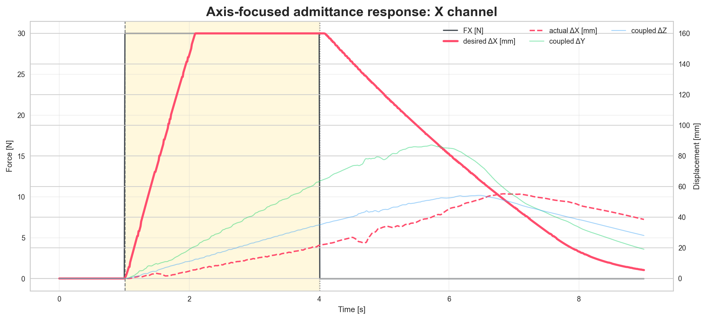
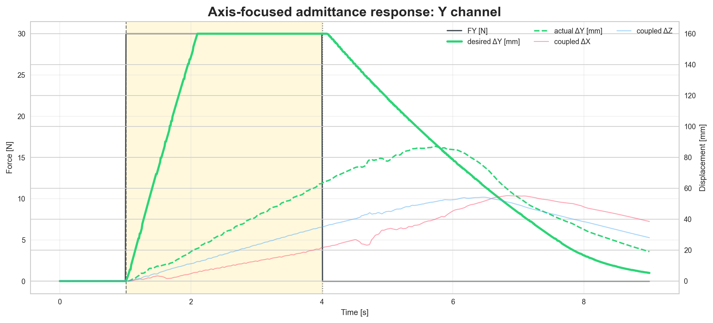
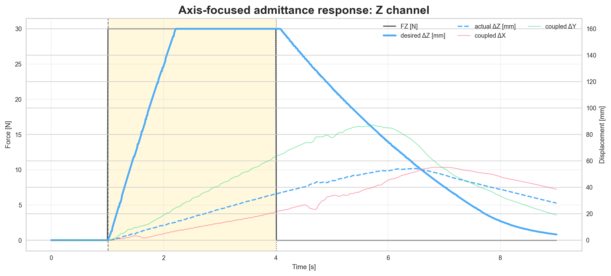
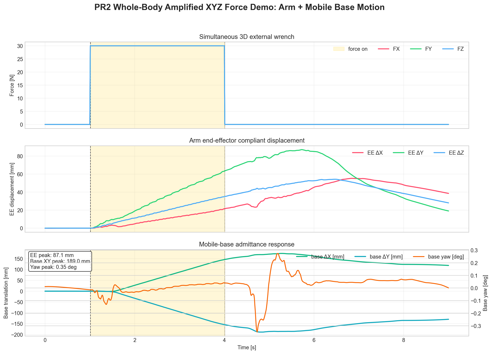
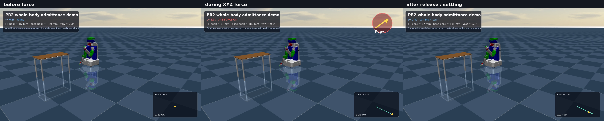

# PR2-Sim-Pure `force_tracking_reference` 本轮更改审阅报告

报告日期：2026-05-08  
当前分支：`feat`  
项目所有者：胡子涵  
开发结果审阅与验收负责人：江浩华

## 1. 审阅背景与本轮目标

本轮开发按照 `/Users/macstudio/Documents/PLAN.md` 执行，目标是在现有 `feat` 分支上实现第一阶段 `force_tracking_reference` 能力。

本轮明确不做以下事项：

- 不修改 `unitree_mujoco/unitree_robots/pr2/` 下的 MuJoCo XML/MJCF 模型。
- 不实现优化式 QP/WBC。
- 不改变现有 fixed-equilibrium 行为的默认地位。
- 不提交本轮 acceptance 新生成的视频或大型媒体文件。

本轮新增的核心能力是：外力不再只能触发相对启动平衡点的临时顺应位移，而是可以在 `reference_mode:=force_tracking` 下推动一个动态参考位置；撤力后参考速度衰减到 0，但参考位置保持在新的目标位置，不主动回到启动点。

## 2. 我做了什么

### 2.1 新增动态参考状态机

在 `pr2_mujoco_bridge/admittance_core.py` 中新增 `ForceTrackingReferenceState`，作为纯 Python/NumPy 状态机。它负责把输入外力转换成可验收的动态参考：

```text
external force
  -> filter
  -> deadband
  -> bounded reference velocity
  -> bounded reference position
  -> idle velocity decay after release
  -> held reference position
```

该状态机不依赖 ROS，因此可以用普通 pytest 做快速回归测试。

### 2.2 Arm admittance 增加 `reference_mode`

在 `pr2_arm_admittance.py` 中新增参数：

- `reference_mode:=fixed_equilibrium|force_tracking`
- `force_reference_gain_x/y/z`
- `force_reference_vel_max`
- `force_reference_disp_max`
- `force_reference_idle_decay`
- `force_reference_track_gain`

默认值仍是 `reference_mode:=fixed_equilibrium`。也就是说，现有 launch 如果不显式打开 `force_tracking`，仍走旧路径：撤力后回到启动时捕获的平衡点。

在 `force_tracking` 模式下：

- 外力在 command frame 内经 active axes 过滤。
- `ForceTrackingReferenceState` 生成 `ee_des_*` 动态参考。
- 控制器以动态参考和当前末端位姿之间的误差生成末端速度命令。
- 撤力后 reference 不回零，只让 reference velocity 衰减。

### 2.3 Base admittance 增加 `reference_mode` 和 debug 输出

在 `pr2_base_admittance.py` 中新增同样的 `reference_mode:=fixed_equilibrium|force_tracking` 分支。

新增 base debug topic：

- 默认 topic：`wbc/base/admittance_debug`
- 数据内容：
  - `base_ref_x`
  - `base_ref_y`
  - `base_ref_yaw`
  - `base_vel_cmd_x`
  - `base_vel_cmd_y`
  - `base_vel_cmd_yaw`

这样做的目的是让 whole-body force-tracking 不只看实际 base pose，还能检查“控制器打算让底盘去哪里”，从而区分模型/执行层跟踪不足和参考生成逻辑错误。

### 2.4 新增 force-tracking launch

新增两个 launch 文件：

- `launch/pr2_arm_force_tracking.launch.py`
- `launch/pr2_whole_body_force_tracking.launch.py`

这两个 launch 都显式设置：

- `reference_mode: "force_tracking"`
- `demo_motion: False`
- `use_viewer:=false` 可用于 headless acceptance

Whole-body launch 仍保留现有 coordinator 风格架构：

```text
arm external wrench
  -> force projector
  -> base admittance
  -> pr2_wbc_coordinator
  -> sim command topics
```

它不是 QP/WBC solver，也没有声称是优化式 whole-body controller。

### 2.5 扩展 CSV 记录

在 `pr2_arm_force_injector.py` 中扩展 CSV 列：

- 原有：`pos_*`, `force_*`, `adm_disp_*`, `adm_vel_*`, `ee_des_*`, `ee_vel_cmd_*`, `qdot_cmd_norm`, `tau_*`, `base_*`
- 新增：`base_ref_x`, `base_ref_y`, `base_ref_yaw`
- 新增：`base_vel_cmd_x`, `base_vel_cmd_y`, `base_vel_cmd_yaw`

这些列是后续验收 force-tracking 参考保持和 base 跟踪行为的必要数据。

### 2.6 扩展 validator

在 `scripts/validate_force_response.py` 中新增 `--force-tracking` 模式。

新增检查项包括：

- reference peak 是否达到最低展示/响应幅值。
- actual peak 是否达到最低响应幅值。
- actual-reference tracking error 是否在阈值内。
- 撤力后 reference tail drift 是否足够小。

典型用法：

```bash
python3 $VALIDATOR \
  --csv /tmp/arm_ft_x.csv \
  --force-tracking \
  --reference-prefix ee_des \
  --actual-prefix pos \
  --tracking-axes x,y,z \
  --baseline-skip-samples 60 \
  --tail-samples 120 \
  --min-reference-peak-mm 90 \
  --min-actual-peak-mm 60 \
  --max-tracking-error-mm 80 \
  --max-reference-tail-drift-mm 2
```

Base force-tracking 则使用：

```bash
python3 $VALIDATOR \
  --csv /tmp/wb_ft_x.csv \
  --force-tracking \
  --reference-prefix base_ref \
  --actual-prefix base \
  --tracking-axes x,y \
  --baseline-skip-samples 60 \
  --tail-samples 120 \
  --min-reference-peak-mm 90 \
  --min-actual-peak-mm 40 \
  --max-tracking-error-mm 120 \
  --max-reference-tail-drift-mm 2
```

### 2.7 扩展 plotting 脚本和文档

`scripts/plot_arm_response.py` 从五面板扩展为六面板：

1. 外力输入
2. 动态参考或 admittance 输出
3. 实际末端响应
4. actual-reference tracking error
5. 执行层命令摘要
6. tail zoom 稳定性检查

`scripts/plot_whole_body_response.py` 现在会在 CSV 有参考列时叠加显示 arm/base reference，并显示 base tracking error 摘要。

`README.md` 和 `README_ACCEPTANCE_FEAT.md` 已补充 force-tracking 模式说明、launch 命令、validator 命令和验收阈值。

## 3. 我是怎么做的

本轮实现按测试先行的顺序推进：

1. 先在 `test_admittance_core.py` 中写 `ForceTrackingReferenceState` 行为测试。
2. 验证新增测试在实现前失败，因为 `ForceTrackingReferenceState` 尚不存在。
3. 实现纯状态机，让测试转绿。
4. 在 arm/base ROS 节点中加入 `reference_mode` 分支，默认保留旧逻辑。
5. 新增 launch 和 CSV/debug 通道。
6. 扩展 validator 测试，锁定 held-reference 通过、tail drift 失败这两个关键验收行为。
7. 更新 plot 和 README，让后续验收可以复现并解释结果。

这一路径的关键点是：先把 force-tracking 的数学行为做成可单元测试的纯逻辑，再接入 ROS 节点和 launch，避免一开始就把问题混在 MuJoCo/ROS 运行时里调试。

## 4. 为什么这样做

### 4.1 保留默认旧模式，降低回归风险

现有 acceptance 建立在 fixed-equilibrium 模式之上。若直接改变默认 admittance 语义，会导致旧的 zero-force、arm 1D/3D、whole-body acceptance 结果不可比较。

所以本轮新增 `reference_mode`，并让默认保持：

```text
reference_mode := fixed_equilibrium
```

只有新 launch 显式打开：

```text
reference_mode := force_tracking
```

### 4.2 把第一阶段目标限制在 dynamic reference

PLAN.md 明确第一阶段不做完整 QP/WBC。当前最有价值的验证切片是：外力是否可以稳定地转换成新的参考目标，并在撤力后保持。

这比直接重写 whole-body controller 风险更小，也更容易被江浩华验收：

- CSV 可以量化 reference peak。
- CSV 可以量化 actual peak。
- CSV 可以量化 tracking error。
- CSV 可以量化撤力后的 reference drift。

### 4.3 让 arm 和 base 共用同一类行为

Arm 和 base 都使用同一类 force-tracking reference 语义：

- arm：`ee_des_*`
- base：`base_ref_*`

这样后续验收 whole-body 时，可以用同一个 validator 检查两套参考。

## 5. 媒体状态说明

本报告附带引用仓库中已有的 whole-body/admittance 演示图片和视频，用于帮助审阅者理解当前 PR2 admittance/whole-body demo 的视觉背景。

重要限制：

- 下列媒体不是本轮 force-tracking acceptance 新生成结果。
- 它们来自仓库已有目录 `docs/whole_body_admittance_demo/`。
- 当前 macOS host 没有 ROS 2 Jazzy、`ros2`、`colcon`，Docker daemon 也未运行，因此本轮没有生成新的 force-tracking PNG/MP4。
- 新的 force-tracking 媒体应在 devcontainer 或 Ubuntu 24.04 + ROS 2 Jazzy 环境中，通过新增 launch、validator、plot 脚本生成。

### 5.1 单轴 admittance 响应图

X 轴响应：



Y 轴响应：



Z 轴响应：



这些图片适合作为背景材料，说明项目已有 admittance response 可视化风格。它们不代表本轮 `force_tracking_reference` 的新验收结果。

### 5.2 Whole-body base + arm 汇总图



这张图适合作为 whole-body 响应展示背景，用于说明 arm 和 mobile base 同时参与响应时的可视化目标。

### 5.3 Whole-body 明显运动截图



这张图用于说明“强展示”希望达到的视觉效果：base 和 arm 的运动应足够明显，便于审阅和演示。

### 5.4 Whole-body 演示视频

视频文件：

[PR2 whole-body XYZ response motion obvious video](whole_body_admittance_demo/pr2_whole_body_xyz_response_motion_obvious.mp4)

HTML 预览标签：

<video controls src="whole_body_admittance_demo/pr2_whole_body_xyz_response_motion_obvious.mp4"></video>

该视频同样是仓库已有演示资产，不是本轮 force-tracking acceptance 新生成视频。

## 6. 已运行验证

### 6.1 项目结构检查

命令：

```bash
bash scripts/verify_ai_project.sh
```

结果：

```text
PASS: project layout verification passed.
```

该检查确认：

- 关键说明文件存在。
- ROS package markers 仍在 workspace `src/` 下。
- 没有生成并遗留 `build/`, `install/`, `log/`, `.venv`, `venv` 等不应提交目录。

### 6.2 Shell 语法检查

命令：

```bash
bash -n scripts/verify_ai_project.sh scripts/ai-codex.sh scripts/ai-claude.sh
```

结果：退出码为 0。

### 6.3 本地可运行 pytest 子集

命令：

```bash
PYTHONPATH=pr2_ws/src/pr2_mujoco_bridge \
/tmp/pr2-sim-pure-test-venv/bin/python -m pytest \
  pr2_ws/src/pr2_mujoco_bridge/test/test_admittance_core.py \
  pr2_ws/src/pr2_mujoco_bridge/test/test_validate_force_response.py \
  pr2_ws/src/pr2_mujoco_bridge/test/test_wbc_single_controller.py \
  pr2_ws/src/pr2_mujoco_bridge/test/test_audit_pr2_mjcf_limits.py \
  -q
```

结果：

```text
28 passed in 0.15s
```

这组测试覆盖：

- `ForceTrackingReferenceState` 动态参考保持和限幅。
- `validate_force_response.py` 的 fixed-equilibrium 和 force-tracking 检查。
- 新 force-tracking launch 的 wiring。
- CSV/debug 通道声明。
- 既有 WBC coordinator 单一汇合点约束。
- MJCF limits 审计测试。

### 6.4 Python 语法编译检查

命令：

```bash
/tmp/pr2-sim-pure-test-venv/bin/python -m compileall -q \
  pr2_ws/src/pr2_mujoco_bridge/pr2_mujoco_bridge \
  pr2_ws/src/pr2_mujoco_bridge/scripts \
  pr2_ws/src/pr2_mujoco_bridge/launch
```

结果：退出码为 0。

### 6.5 Diff 空白检查

命令：

```bash
git diff --check
```

结果：退出码为 0。

## 7. 未能运行的验证

### 7.1 全量 pytest

命令：

```bash
PYTHONPATH=pr2_ws/src/pr2_mujoco_bridge \
/tmp/pr2-sim-pure-test-venv/bin/python -m pytest \
  pr2_ws/src/pr2_mujoco_bridge/test -q
```

结果：未能完成收集。

原因：

```text
ModuleNotFoundError: No module named 'rclpy'
```

当前 macOS host 没有 ROS 2 Jazzy 的 Python runtime，因此导入 `pr2_sim_ros.py` 时缺少 `rclpy`。

### 7.2 ROS/colcon build 与 acceptance

未能运行：

```bash
source /opt/ros/jazzy/setup.bash
colcon build --packages-select pr2_mujoco_bridge --symlink-install
colcon test --packages-select pr2_mujoco_bridge
ros2 launch pr2_mujoco_bridge pr2_arm_force_tracking.launch.py ...
ros2 launch pr2_mujoco_bridge pr2_whole_body_force_tracking.launch.py ...
```

原因：

- `/opt/ros/jazzy/setup.bash` 不存在。
- `ros2` 不存在。
- `colcon` 不存在。
- Docker daemon 未运行，无法进入 devcontainer。

因此本轮报告中的 force-tracking acceptance 命令已经写入文档，但实际 CSV/PNG/MP4 需要在 Ubuntu 24.04 + ROS 2 Jazzy 环境中补跑。

## 8. 江浩华验收清单

建议江浩华按以下顺序验收。

### 8.1 旧模式回归

目标：确认默认 fixed-equilibrium 没被破坏。

建议执行：

- Zero-force stability
- Single-arm 1D
- Single-arm 3D: `y`, `z`, `xyz`
- Whole-body: `x`, `xyz`

对应命令见 `README_ACCEPTANCE_FEAT.md` 中 fixed-equilibrium 部分。

验收重点：

- 默认 launch 不显式设置 `reference_mode` 时仍回平衡点。
- 撤力后 tail segment 无持续振荡。
- fixed-equilibrium validator 仍打印 `RESULT: PASS`。

### 8.2 Arm force-tracking 新场景

目标：确认 `ee_des_*` 动态参考能在外力作用下移动，并在撤力后保持。

建议执行：

- `force_axis:=x`
- `force_axis:=y`
- `force_axis:=z`
- `force_axis:=xyz`

示例：

```bash
ros2 launch pr2_mujoco_bridge pr2_arm_force_tracking.launch.py \
  use_viewer:=false \
  force_axis:=x \
  log_file:=/tmp/arm_ft_x.csv
```

验收重点：

- `ee_des_*` reference peak 达到 100-200 mm 量级。
- 撤力后 `ee_des_*` tail drift 小。
- actual EE response 能跟踪 reference。
- command layer 没有明显高频抖动。

### 8.3 Whole-body force-tracking 新场景

目标：确认 arm 和 base 都有动态参考，且 WBC coordinator 仍是单一汇合点。

建议执行：

- `force_axis:=x`
- `force_axis:=xyz`

示例：

```bash
ros2 launch pr2_mujoco_bridge pr2_whole_body_force_tracking.launch.py \
  use_viewer:=false \
  force_axis:=xyz \
  log_file:=/tmp/wb_ft_xyz.csv
```

验收重点：

- `ee_des_*` 有 held reference。
- `base_ref_x/y` 有明显位移，目标是 150 mm 量级。
- actual base pose 有可见响应。
- `base_ref_*` 撤力后不继续漂移。
- `pr2_wbc_coordinator` 仍是 arm/base command 的汇合点，没有新增旁路。

### 8.4 新媒体生成建议

当 ROS/devcontainer 可用后，建议生成本轮专属媒体：

```bash
python3 pr2_ws/src/pr2_mujoco_bridge/scripts/plot_arm_response.py \
  --csv /tmp/arm_ft_x.csv \
  --baseline-skip-samples 60 \
  --save /tmp/arm_ft_x_response.png

python3 pr2_ws/src/pr2_mujoco_bridge/scripts/plot_whole_body_response.py \
  --csv /tmp/wb_ft_xyz.csv \
  --baseline-skip-samples 60 \
  --save /tmp/wb_ft_xyz_response.png
```

Whole-body 视频可以在生成 `/tmp/wb_ft_xyz.csv` 后，用现有视频渲染脚本或记录回放流程生成，但本轮未在 macOS host 上执行。

## 9. 当前风险

### 9.1 参数需要真实仿真调校

当前实现已通过本地逻辑测试，但 force-to-reference gain、velocity limit、base projection scale 是否刚好达到目标展示幅值，需要在 MuJoCo + ROS 2 中实测。

主要风险：

- arm reference 达到目标，但 actual EE 跟踪不足。
- base reference 达到 150 mm 量级，但 actual base motion 受模型/控制限制不足。
- force-tracking 参数过强时可能引入 overshoot 或 tail oscillation。

### 9.2 本轮没有真实 force-tracking acceptance CSV

由于当前 host 缺少 ROS 2 Jazzy 和 Docker daemon，本轮没有生成新的：

- `/tmp/arm_ft_*.csv`
- `/tmp/wb_ft_*.csv`
- force-tracking PNG
- force-tracking MP4

因此提交前若要达到完整验收，应在 ROS/devcontainer 环境中补跑 `README_ACCEPTANCE_FEAT.md` 的 force-tracking 部分。

### 9.3 既有媒体不能替代本轮验收

本报告引用的图片/视频只用于说明既有演示风格和目标视觉效果。它们不能作为本轮 `force_tracking_reference` 功能正确性的证据。

## 10. 提交前结论

本轮代码已经完成第一阶段 `force_tracking_reference` 的工程实现和本地可运行测试覆盖：

- 默认 fixed-equilibrium 行为保留。
- 新 force-tracking 模式通过独立 launch 启用。
- arm 和 base 都有动态参考语义。
- CSV、validator、plot、acceptance 文档已支持审阅和复现。

但提交前仍建议由江浩华在 ROS 2 Jazzy/devcontainer 环境中完成最终验收，尤其是：

- 旧 fixed-equilibrium acceptance 回归。
- 新 arm force-tracking `x/y/z/xyz`。
- 新 whole-body force-tracking `x/xyz`。
- 新 PNG/MP4 生成和人工视觉审阅。

